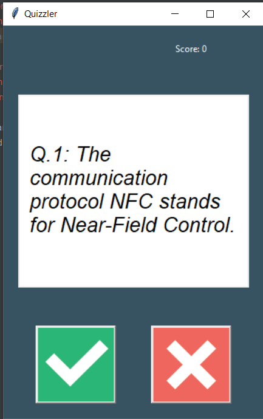

# day 34 : GUI Quiz App

Week: Week 4

# **Overview**

---

In the project, I built a True or False quiz game with a GUI and pick the question from a API. I reuse the day 17 code as the starting code.

# **Features**

---

- Using Trivia API database to load question
- Ture or False buttons for user to response
- Display scores and update it when user’s answer is correct
- Flash card color( green or red) to let the user if they answer correct
- 




# Used Concept

---

- API request / response
- API parameters
    - A full API request URL can slice to two part
    - Example: `https://opentdb.com/api.php?amount=10&type=boolean`
        - Base URL:`https://opentdb.com/api.php`
        - parameters:`?amount=10&type=boolean`
        
        ```python
        parameters= {
            "amount" : 10,
            "type": "boolean"
        }
        
        response = requests.get("https://opentdb.com/api.php",params=parameters)
        ```
        
- Data type hints and arrows:
    - It is a good practice if you specify the input and output of a function
        
        ```python
        # This mean this function parameter must be int and return must be bool
        def check(age:int) -> bool:
        	if age>18:
        		return True
        	else:
        		return False
        ```
        

# Issue and Solution

---

- There are HTML Entities in the question and make the question hard to read.
    
    Solution: import html and use the `unescape` function 
    

# Usage/**Installation**

---

1. Make sure your computer install python 3
2. Download the folders
3.  In the folder directory, activate the virtual environment:

**Mac OS / Linux**

```bash
source venv/bin/activate

```

**Windows**

```bash
venv\Scripts\activate
```

After you've done that you should be able to run the `main.py` program. 

```bash
py main.py
```